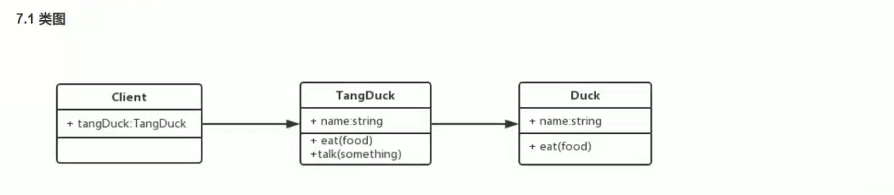
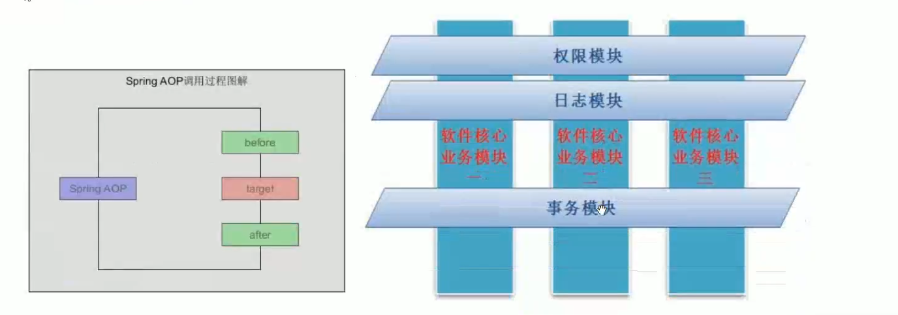
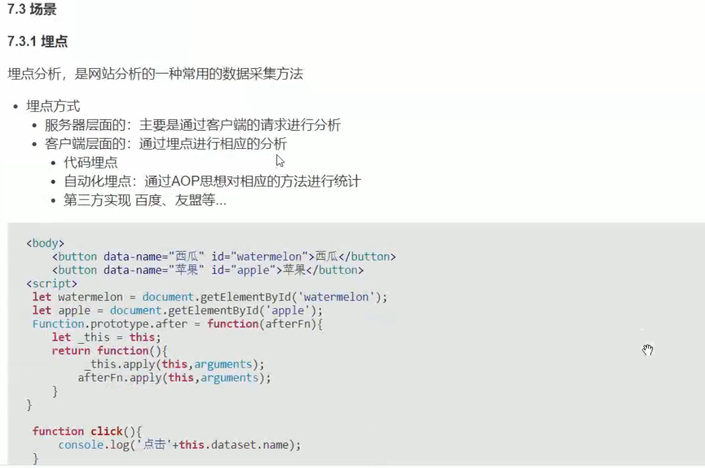

# 装饰者模式

> 在不改变原有的结构和功能为对象添加新功能
> 装饰比继承更加灵活

## 应用场景

> 装饰器模式是将一个对象嵌入另一个对象之中，实际上相当于这个对象被另一个对象包装起来，形成一条包装链；
> 请求随着这条链条依次传递到所有的对象，每个对象有处理这个请求的机会

## AOP

> 在软件业，AOP为Aspect Oriented Programming的缩写，意为：面向切面编程
> 可以通过预编译方式和运行期动态代理实现在不修改源代码的情况下给程序动态统一添加功能的一种技术

## 使用场景

1. 埋点

2. 表单验证
3. 防CSRF攻守

