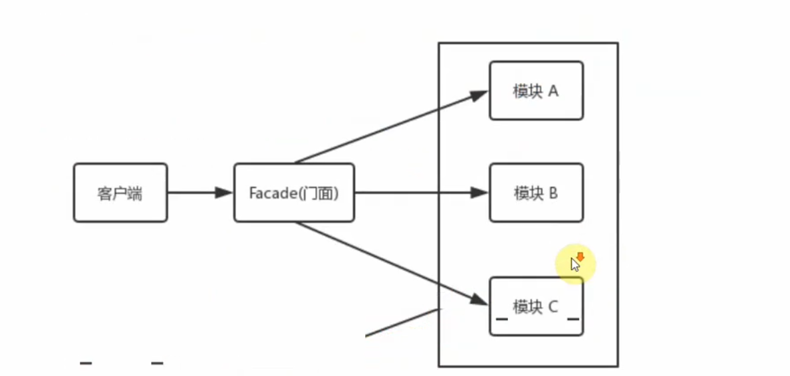
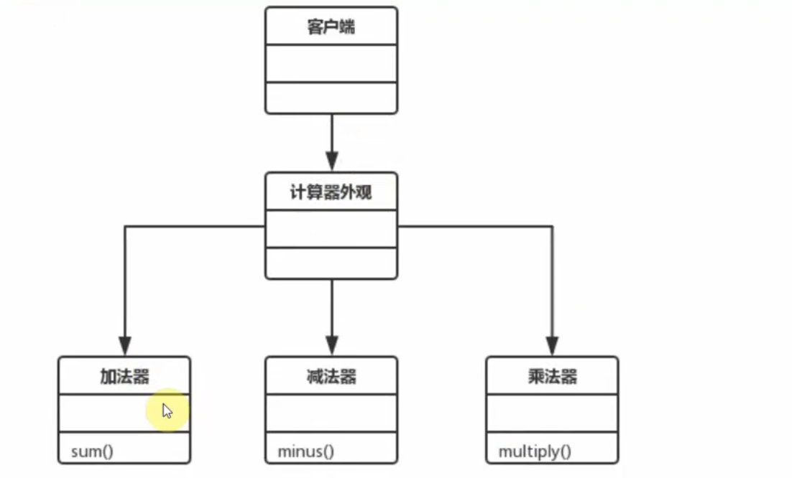

# 外观模式

该模式就是把一些复杂的流程封装成一个接口供给外部用户更简单的使用

> 门面角色：外观模式的核心，它被客户角色调用，它熟悉子系统的功能，内部根据客户角色的需求预定每个功能的组合
> 子系统角色：实现了子系统的功能，它对客户角色和Facade是未知的
> 客户角色：通过调用Facade来完成要实现的功能

## 应用场景
 
 * 为复杂的模块或子系统提供外界访问的模块
 * 子系统相互独立

 1. redux
 2. 