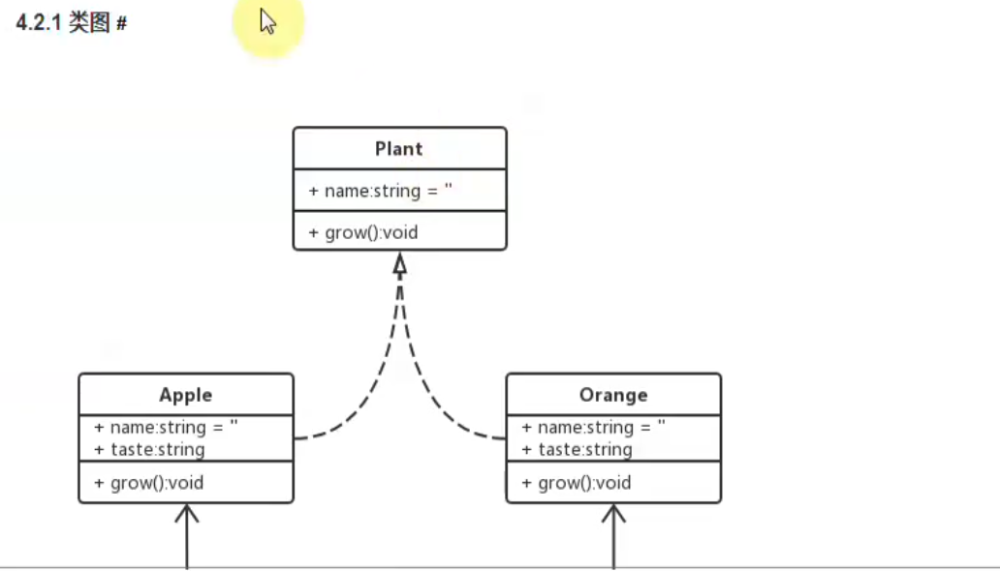
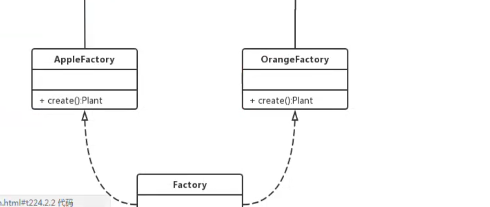
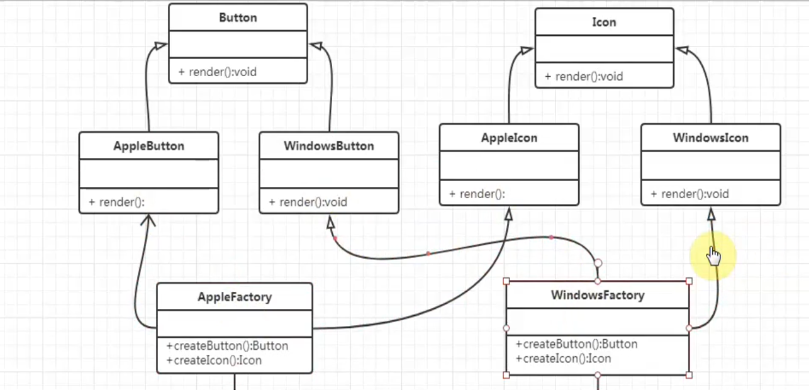
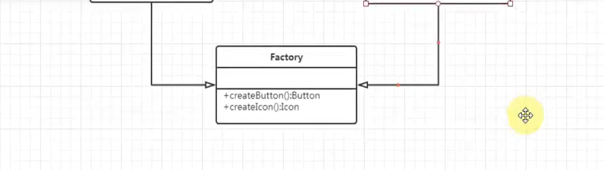

# 类图和对象图

# 工厂模式

## 简单工厂模式

> 简单工厂模式是由一个工厂对象决定创建出哪一种产品类的实例

### 经典场景

## 工厂方法模式
> 工厂方法模式Factory Method，又称多态性工厂模式；
> 在工厂方法模式中，核心的工厂类不再负责所有的产品创建，而是将具体创建的工作交给子类去做；

## 抽象工厂模式

> 抽象工厂模式是指当有多个抽象角色时，使用的一种工厂模式
> 抽象工厂模式可以像客户端提供一个接口，是客户端在不必制定产品的具体情况下；

