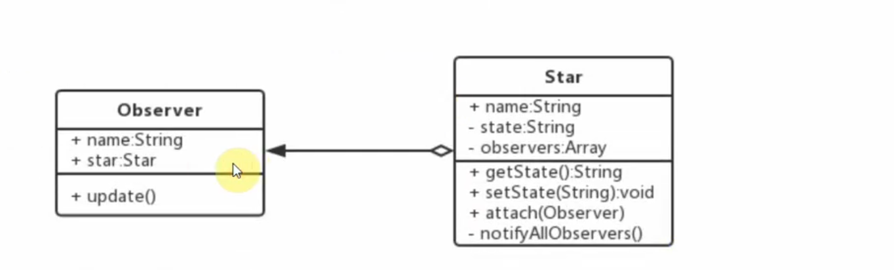
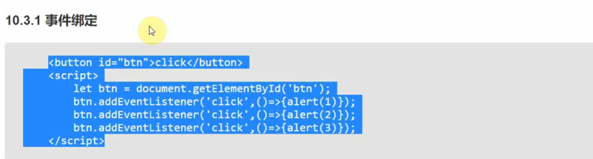
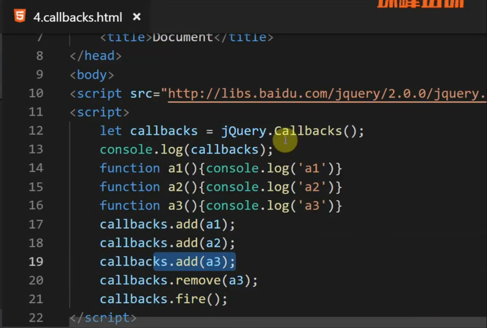
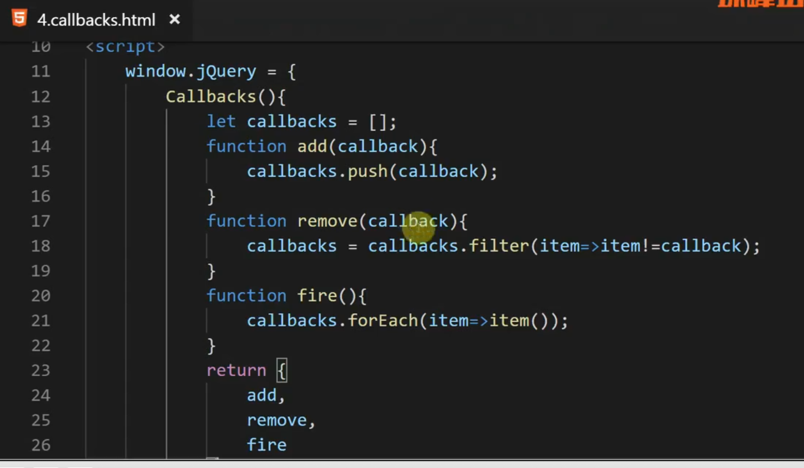
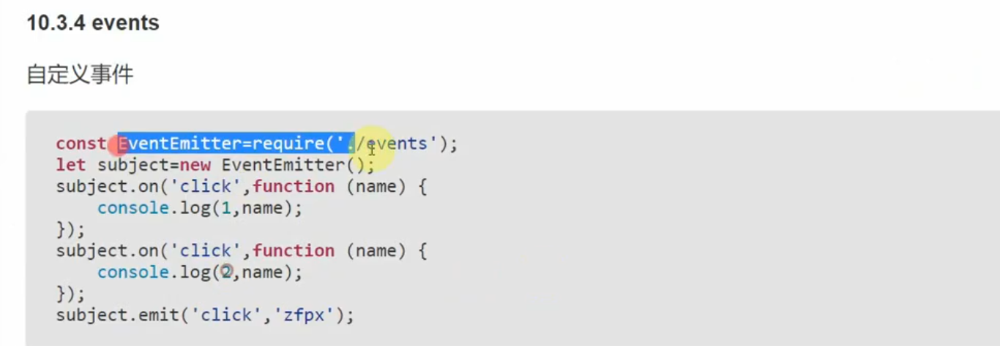
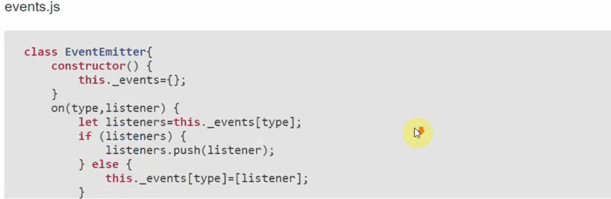
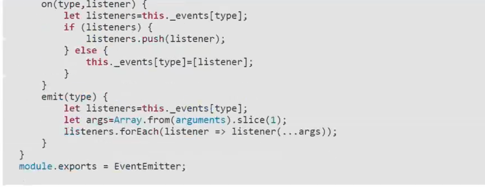
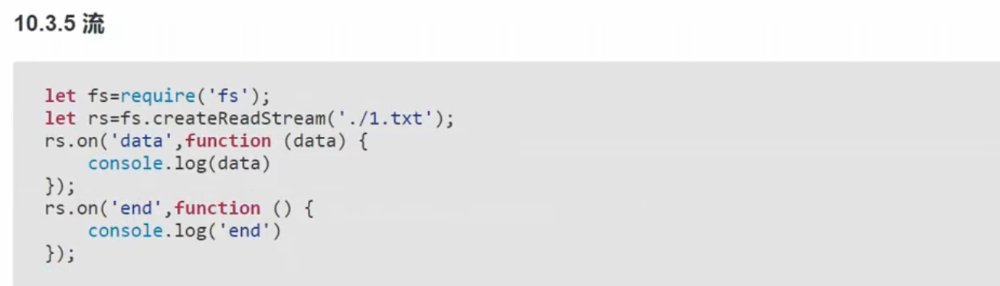
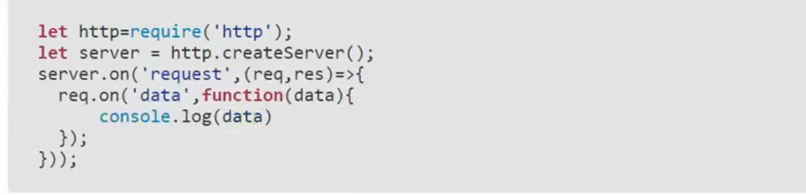

# 观察者模式

* 被观察者供维护观察者的一系列方法
* 观察者提供更新接口
* 观察者把自己注册到被观察者里面
* 在被观察者发生变化时候，调用观察者的更新方法

## 场景

1. 事件绑定

2. Promise原理
3. callbacks

删除jquery的引入，自定义window.jQuery方法

4. events

5. stream

6. http

7. redux

